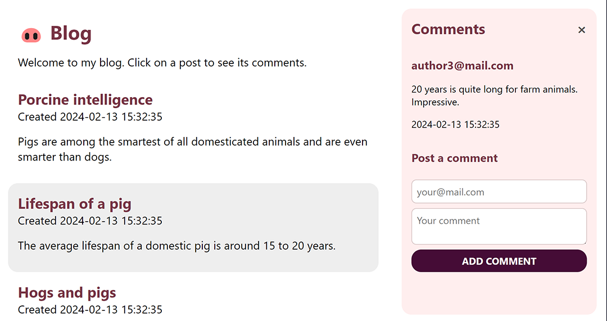
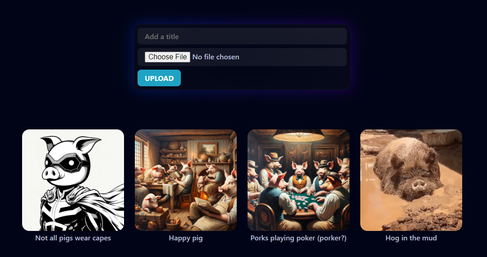

# 🐽 Examples

All the examples in this folder are standalone projects that demonstrate how to use oink.php in different scenarios. They should work out-of-the-box in an Apache server with PHP enabled, as the root of a website.

## Blog

The blog is a simple example that demonstrates how to use the minimal functionalities and defaults of oink.php.

Some details it:
* It provides endpoints to list posts and comments, and post a new comment.
* It also has a simple one-file frontend that uses the `fetch` API to interact with the backend.
* The `.htaccess` file provided routes all requests to `index.php`, which tries to serve them from the API, and if it's not an API call, will continue execution and serve the HTML that follows it.
* The database is a simple SQLite that is created and populated in the `db.php` file, which also contains the database functions.

## Gallery

The gallery is a more advanced example that showcase the use of file handling with an image upload service.

Some details it:
* It provides endpoints to list recent uploads, get a specific image, and upload a new image.
* The JS and CSS are isolated in separate `app.js` and `style.css` files, and are served by the server.
* Usually, you'd want to serve your static files directly from the server without going through PHP, but in certain cases (such as private user images) you need some extra logic to ensure that the person has access to the file.
* The `.htaccess` file provided routes all requests to `index.php` except those for JS and CSS files, which are served directly. This exception is made so that the server won't serve the images directly.
* As in the previous example, the database is a simple SQLite that is created and populated in the `db.php` file, which also contains the database functions.